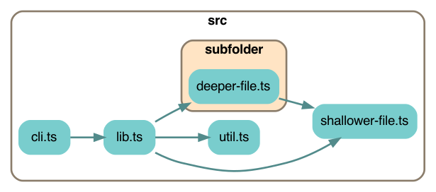

# Depchart

Makes a dependency chart showing the import relationships between the source code files in a directory.

Requires `graphviz` to be [installed on your system](https://graphviz.org/download/).

## Caveats

This is not very smart; it will find imports inside comments.

It uses regular expressions to find [ESM style imports](https://developer.mozilla.org/en-US/docs/Web/JavaScript/Reference/Statements/import) in every file you throw at it.  You should limit it to source code files using a glob pattern like `src/**.ts*`

It's only been tested on Typescript files but it should also work on javascript files as long as they use ESM style imports.

Supported:
* All kinds of ESM imports
* Typescript
  * `import x = require('foo');`
  * `let promise = require('foo');`
* Javascript
  * `let x = require('foo');`

Not supported yet:
* Typescript
  * `export * from './foo';`

If an import starts with a period it's considered a local file import; otherwise it's treated as a 3rd party package import and it will only be shown if you use the `--node_modules` option.

## Tweaks

If the regexes need fine tuning, or you want to add more file types, find them in `lib.ts`.

To change the colors, search for `Style` in `lib.ts` and refer to the [graphviz color chart](https://www.graphviz.org/doc/info/colors.html).

## Install

First, [install graphviz](https://graphviz.org/download/).

Test if graphviz is installed:
```sh
dot --version
```

Install depchart:
```sh
npm install --global depchart
```

## Use

`cd` into the root directory of your source code and run `depchart` there.

The default output name is `depchart`.  This will write `depchart.dot`, `depchart.png`, and `depchart.svg` into your current directory.

```
Usage:
  depchart <sourceFiles> <flags>

Positional arguments:
  sourceFiles

Optional arguments:
  -h, --help            show this help message and exit

  -x [EXCLUDE ...], --exclude [EXCLUDE ...]
      Exclude these files.  You can use glob patterns here.

  -o OUTPUT, --output OUTPUT
      Output file basename (default: "depchart")

  -n, --node_modules
      Include node_modules (default: false)

  --open
      Show the resulting image (MacOS only)

  -r RANKDIR, --rankdir RANKDIR
      Layout direction: TB | BT | LR | RL (default: TB)
```

## Example output on its own codebase

```sh
depchart src/**.ts
```


---

Excluding `subfolder`

Note we have to exclude all the individual files in `subfolder`, we can't just say "subfolder".

```sh
depchart src/**.ts --exclude subfolder/**
```


---

Including node_modules:

This shows the 3rd party packages that are directly included by your own code.  It does not show deeper transitive dependencies.

```sh
depchart src/**.ts -n
```


---

Changing the flow direction with `rankdir`

```sh
depchart src/**.ts --rankdir LR
```


