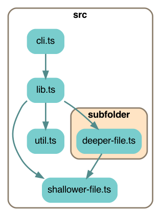
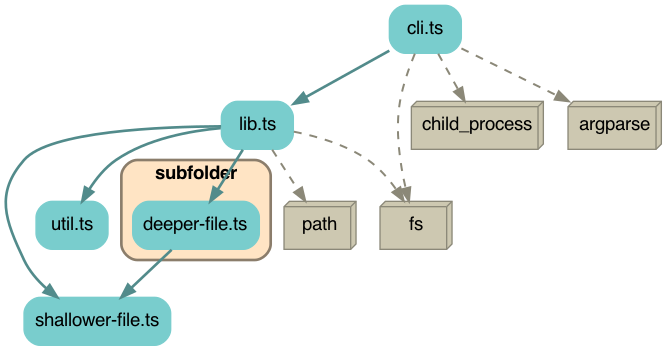
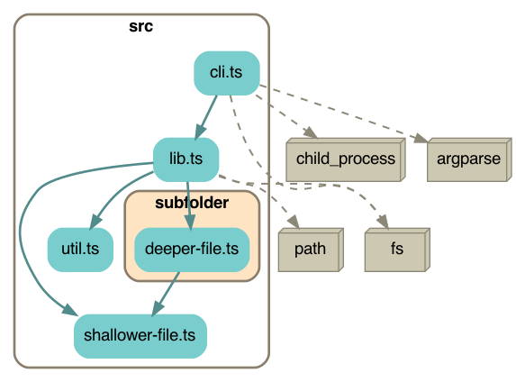
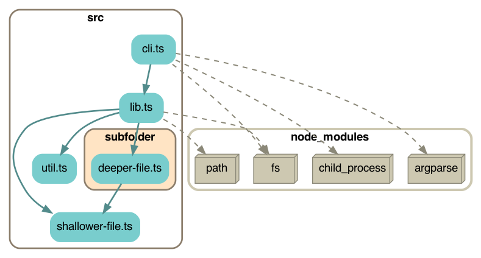

# Depchart



Makes a dependency chart showing the import relationships between the source code files in a directory.

Requires `graphviz` to be [installed on your system](https://graphviz.org/download/).

## Caveats

This is not very smart; it will find imports inside comments.

It uses regular expressions to find [ESM style imports](https://developer.mozilla.org/en-US/docs/Web/JavaScript/Reference/Statements/import) in every file you throw at it.  You should limit it to source code files using a glob pattern like `src/**.ts*`

It's only been tested on Typescript files but it should also work on javascript files as long as they use ESM style imports.

Supported:
* All kinds of ESM imports
* Typescript
  * `import x = require('foo');`
  * `let promise = require('foo');`
* Javascript
  * `let x = require('foo');`

Not supported yet:
* Typescript
  * `export * from './foo';`

If an import starts with a period it's considered a local file import; otherwise it's treated as a 3rd party package import and it will only be shown if you use the `--node_modules` option.

## Horrible caveat: glob patterns

This is only useful if you can do `**` in your shell to get recursive matches, because depchart doesn't recurse into directories for you -- you have to provide a list of actual filenames.

`**` is called "globstar".

This is possible in:
* bash 4+, and it has to be enabled with `shopt -s globstar`
* zsh
* fish shell

It's **not possible in bash 3**, which is the default on many Macs, so it's annoying to pass all your filenames to depchart.

Here's a guide to [upgrade to bash 4 on a Mac](https://gist.github.com/reggi/475793ea1846affbcfe8).

As a workaround in bash, you can use "subshell command substitution" like this:

```bash
# test that this prints the files you want
find src | grep .ts

# insert them into the depgraph command
depgraph `find src | grep .ts`

# another way to do it, works the same way
depgraph $(find src | grep .ts)
```

## Tweaks

If the regexes need fine tuning, or you want to add more file types, find them in `lib.ts`.

To change the colors, search for `Style` in `lib.ts` and refer to the [graphviz color chart](https://www.graphviz.org/doc/info/colors.html).

## Install

First, [install graphviz](https://graphviz.org/download/).

Test if graphviz is installed:
```sh
dot --version
```

Install depchart:
```sh
npm install --global depchart
```

## Use

`cd` into the root directory of your source code and run `depchart` there.

The default output name is `depchart`.  This will write `depchart.dot`, `depchart.png`, and `depchart.svg` into your current directory.

```
Usage:
  depchart <sourceFiles> <flags>

Positional arguments:
  sourceFiles

Optional arguments:
  -h, --help            show this help message and exit

  -x [EXCLUDE ...], --exclude [EXCLUDE ...]
      Exclude these files.  You can use glob patterns here.

  -o OUTPUT, --output OUTPUT
      Output file basename (default: "depchart")

  -n, --node_modules NODE_MODULES_STYLE
      How to show 3rd party packages:
      Choose one of "omit" (default), "integrated",
      "separated", or "boxed".

  --open
      Show the resulting image (MacOS only)

  -r RANKDIR, --rankdir RANKDIR
      Layout direction: TB | BT | LR | RL (default: TB)
```

# Example output on its own codebase

All of these examples assume you have "globstar" `**` support in your shell; see above.

## Default output
```sh
depchart src/**.ts
```


---

## Excluding `subfolder`

Note we have to exclude all the individual files in `subfolder`, we can't just say "subfolder".

You have to provide the full path to each file you want to exclude.  You can't exclude directories themselves.

```sh
depchart src/**.ts --exclude subfolder/**
```


---

## Changing the flow direction with `rankdir`

Left-to-right, instead of top-to-bottom

```sh
depchart src/**.ts --rankdir LR
```


---

## 3rd party modules

This shows the 3rd party packages that are directly included by your own code.  It does not show deeper transitive dependencies.

There are 4 options:
* `omit` (the default, seen above)
* `integrated`
* `separated`
* `boxed`

```sh
depchart src/**.ts --node_modules integrated
```

### Integrated:



### Separated:



### Boxed:

